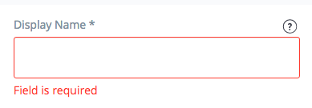
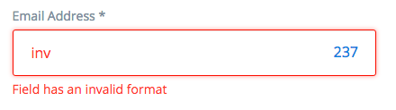
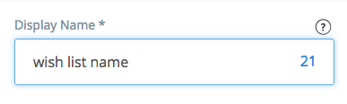
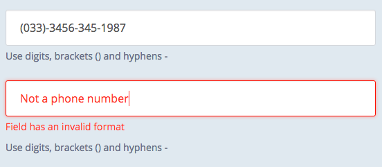

The **builder.inputs** Angular module provides a mechanism for client-side field validation. The **builder.inputs** module contains the <b>builder-input</b> Angular directive, which allows you to validate any input or text area field.

In this document, you will learn more about client-side field validation in your Builder module.

To begin, you must:

* Include the **https://builder.yaas.io/public/js/builderInputs.js** file using the script:

```html
    <script src="https://builder.yaas.io/public/js/builderInputs.js"></script>
```

Keep in mind that **builder.inputs** uses the **angular-translate** module internally to provide localized error and help messages. If you don't use it in your Builder module, you will need to include two additional files **before** `builderInputs.js`:

```html
    <script src="https://builder.yaas.io/public/js/vendor/angular-translate/angular-translate.js"></script>
    <script src="https://builder.yaas.io/public/js/vendor/angular-translate-loader-static-files/angular-translate-loader-static-files.js"></script>
```

* Add **builder.inputs** to your module as shown:

```js
var wishlistItem = angular.module("wishlistItem", ["builder.inputs"]);
```

* Inject **inputValidator** service into your controller as shown:

```js
wishlistItem.controller('wishlistItemController',
    ['$scope', 'inputValidator',function ($scope, $timeout) {}]);
```

### Validation rules

The <b>builder-input</b> attribute enables you to specify one of following validation rules:

<ul>
<li> **url** - a web address starting with http, ftp, or https</li>
<li> **secureUrl** - a web address starting with https</li>
<li> **email** - an email address</li>
<li> **restrictedName** - only digits and letters are valid</li>
<li> **noRestriction** - all characters are valid</li>
<li> **decimal** - a decimal value</li>
</ul>

The <b>builder-input</b> attribute works with the <b>required</b> attribute, which prevents the user from saving without providing mandatory data.

### Triggering validation

Validation is triggered automatically after the user leaves the field, or as soon as the user types an invalid character. If validation detects one or more invalid characters, The field is marked red and a hint is displayed beneath the field.

As a Builder module developer, you can bind validation with the save action, as shown in this example:

```html
    <form role="form" name="form">
        <div class="col-sm-6">
            <div class="form-group">
                <label class="control-label">Name</label>
                <input type="text" name="Wishlist Item Name" builder-input="noRestriction" class="form-control input-lg" ng-model="wishlistItem.name" required></input>
            </div>
        </div>
        <button type="button" class="btn btn-default" ng-click="update(form, updateWishlistItem)">Update</button>
    </form>
```

You must pass the form name as the first argument, and the function name (which will be triggered after validation) as the second argument, to the function bound with the trigger action. Subsequent arguments (third, fourth, and so on) are passed to your function (in this example, arguments are passed to `updateWishlistItem`).

```js
$scope.update = inputValidator.triggerValidation.bind(inputValidator);
```



In this example, the user must fill in the `wishlistItem.name` to be able to update. As soon as the user clicks the `Update` button, the service triggers the validation. The `updateWishlistItem` function is called only if the `wishlistItem.name` is valid.

```html
    <input type="text" name="Contact Person" builder-input="email" class="form-control input-lg" ng-model="contactPerson.email"></input>
```




In this example, a valid email is the only correct input.

### Restricting field length

With the <b>max-character</b> attribute, you can specify how many characters the user can type into a field. The attribute accepts a positive integer number as the value.

```html
    <input type="text" name="Wishlist Item Name" builder-input="noRestriction" class="form-control input-lg" ng-model="wishlistItem.name" required max-character="35"></input>
```



### Custom validation rules
If you want to use custom validation rules, you need to define them first. Use **inputValidator.addValidator** to do it. Define the name of your rule, the regular expression representing the valid field's pattern, the regular expression representing allowed characters, the minimum and maximum allowed field length.
```js
inputValidator.addValidator(name, formatRegex, characterRegex, minLength, maxLength);
```
For example, use the following call in your controller:
```js
$scope.save = inputValidator.triggerValidation.bind(inputValidator);
inputValidator.addValidator("phoneNumber", /\(?([0-9]{3})\)?([ .-]?)([0-9]{3})\2([0-9]{4})/, null, 3, 35);
```
If you want to add a helpful hint text for the input field, use the **inputValidator.addHintTextTranslations**  in your controller:
```js
var translatedHintText = "Use digits, brackets () and hyphens -";
inputValidator.addHintTextTranslations("phoneNumber", translatedHintText);
```
In the view, define an input field and use your custom validation rule name as the **builder-input** attribute :
```html
<input type="text" name="User Phone Number" builder-input="phoneNumber" class="form-control input-lg" ng-model="user.phone" ></input>
```


