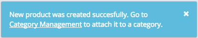

The Builder is a tool in which you can manage your account, projects, services, clients, and packages. It is also a container in which you can integrate your own Builder module to manage your services. The Builder module must be an HTML-based view registered with a package providing the URL pointing to the module.

### Module descriptor

The Builder module is defined in a JSON file. Its structure is made out of JSON objects that outline the module's properties.
It's built out of widgets whose purpose, form, and functionality can differ within a single Builder module. Here are a few rules to keep in mind when creating the **module.json** file:
<ul>
<li>There are several meanings of the widgets in the Builder modules: enriching **navigation**, specifying **settings**, and **translating** modules into different languages.</li>
<li>You can adjust the settings to your needs in the Builder module, but the **viewUrl** setting is required.</li>
<li>You can create widgets of various types according to your needs, including **arrays**, **objects**, **strings** and **booleans**.</li>
</ul>

Here is the full schema of the **module.json** file in extendable code snippet:

<br>

<div class="expand-collapse" data-caption="JSON Schema">

<pre><code>{
  "id":"root",
  "type":"object",
  "title":"Builder Module Descriptor",
  "description":"Root element of builder module descriptors.",
  "properties":{
    "widgets":{
      "id":"widgets",
      "type":"array",
      "title":"Widgets",
      "description":"List of widgets of the Builder module. It is a tree of widgets, which can include sub-widgets and build a tree navigation structure.",
      "items":[
        {
          "id":"widget",
          "type":"object",
          "title":"Widget",
          "description":"Widget represents single navigation node and the corresponding view.",
          "properties":{
            "id":{
              "type":"string",
              "title":"Widget ID",
              "description":"Widget ID should be unique for each Builder module. It is used to navigate to path of the view defined in it."
            },
            "title":{
              "type":"string",
              "title":"Widget title",
              "description":"Widget title is used to display the node in the navigation area of the Builder."
            },
            "settings":{
              "type":"object",
              "title":"Widget settings",
              "description":"This object is meant to be sent to the Builder module view associated with this widget. Add a property to this object for every setting your view should receive.",
              "properties":{
                "viewUrl":{
                  "id":"viewUrl",
                  "type":"string",
                  "title":"View URL",
                  "description":"This setting is mandatory and defines the URL of the view to be displayed when user navigates to this widget."
                },
                "example_setting":{
                  "type":"string",
                  "title":"Just an sample setting",
                  "description":"This is just a sample setting. You can add any amount of different settings to the 'settings' object."
                }
              },
              "required":[
                "viewUrl"
              ]
            },
            "virtualChildren":{
              "type":"boolean",
              "title":"Virtual children flag",
              "description":"If true, child widgets of this widget will be navigable only by programming or through browser URL. They will be not displayed in the navigation structure of the Builder."
            },
            "dynamic":{
              "type":"string",
              "title":"Dynamic parameter",
              "description":"Name of a dynamic property. If set, this node will require the value of the dynamic parameter to be set. See dynamic parameters documentation."
            },
            "remoteNavigation":{
              "type":"boolean",
              "title":"Remote navigation flag",
              "description":"If true, the navigation is technically performed from the Builder module side. When user navigates from this node to another within the specific module, a message is sent from the Builder to the Builder module with the new navigation path. Builder module takes care of changing the view URL accordingly. This is perfect solution from the performance point of view. It is also usually safe to turn on when the view of this widget includes the builder.js script - which is recommended anyway. Builder.js takes care of these navigation messages and changes the view URL on the module side. This flag can be configured for every widget or globally at the root level."
            },
            "sortingKey": {
              "id": "sortingKey",
              "type":"string",
              "title":"Sorting key parameter",
              "description":"The sorting key influences the order of the external nodes in the builder."
            },
            "scopes": {
              "id": "scopes",
              "type":"array",
              "items": {
                "type": "string"
              },
              "description":"With scopes you can restrict the visibility of this node to a limited group of users."
            },
            "tourStep":{
              "id": "tourStep",
              "type":"object",
              "title":"First contact tour step",
              "description":"Represents a single step of the first contact tour for builder module based on navigation nodes. This step should describe the widget (= navigation node) it is attached to.",
              "properties":{
                "heading":{
                  "type":"string",
                  "title":"Heading",
                  "description":"Heading of the first contact tour step. This is used either as the heading itself or as a key for localization if there is localization for such key."
                },
                "text":{
                  "type":"string",
                  "title":"Text",
                  "description":"Text of the first contact tour step. This is used either as the text itself or as a key for localization if there is localization for such key."
                }
              }
            },
            "widgets":{
              "$ref":"widgets",
              "description":"List of child widgets of the current widget. Use it to build a sub-navigation structure."
            }
          },
          "required":[
            "id",
            "title",
            "settings"
          ]
        }
      ]
    },
    "remoteNavigation":{
      "type":"boolean",
      "title":"Remote navigation flag",
      "description":"Example of the flag implemented globally."
    },
    "tourStep":{
      "id": "tourStep",
      "type":"object",
      "title":"First contact tour step",
      "description":"Represents the first step - introduction - of the first contact tour for builder module. This step is shown as a first step of the tour and should describe the module in general.",
      "properties":{
              "heading":{
                "type":"string",
              "title":"Heading",
                "description":"Heading of the first contact tour step. This is used either as the heading itself or as a key for localization if there is localization for such key."
              },
              "text":{
                "type":"string",
                "title":"Text",
                "description":"Text of the first contact tour step. This is used either as the text itself or as a key for localization if there is localization for such key."
              }
      }
    }
  },
  "required":[
    "widgets"
  ]
}

</code></pre>

</div>

Each object is defined separately and independently in the module descriptor. This is an example of the **module.json** file:

```
{
      "widgets": [
          {
              "id": "wishlist#1",
              "title": "Wishlist",
              "settings": {
                  "description": "Main widget for the Wishlist.",
                  "viewUrl": "/#!/wishlist/",
                  "required": true
              }
          },
          {
              "id": "wishlist#2",
              "title": "Wishlist Details",
              "settings": {
                  "viewUrl": "/#!/administration/details/"
              }
          },
          {
              "id": "wishlist#3",
              "title": "Wishlist Settings",
              "settings": {
                  "viewUrl": "/#!/administration/settings/"
              }
          },
          {
              "id": "wishlist#4",
              "title": "Favorite Wishlists",
              "settings": {
                  "viewUrl": "/#!/administration/favourite/"
              }
          }
      ],
      "translations":{
          "en" : {
              "wishlist#1" : "Wishlist",
              "wishlist#2" : "Wishlist Details",
              "wishlist#3" : "Wishlist Settings",
              "wishlist#4" : "Favourite Wishlists"
          },
          "de" : {
              "wishlist#1" : "Wunschliste",
              "wishlist#2" : "Wunschliste Angaben",
              "wishlist#3" : "Wunschliste Einstellungen",
              "wishlist#4" : "Liebling Wunschlisten"
          }
      }
}
```

The purpose of the **widgets** and **translations** in the previous example is described below:

<ul>
<li>**widgets** - Define the navigation structure using this object. The process of building the navigation sub-tree is described in the next section.</li>
<li>**translations** - Specify the language used in the Builder module. Currently, hybris supports English and German translations.</li>
</ul>

Customize the module descriptor as you like by adding more widgets to the existing structure. You can also specify more than one view for each widget without creating an HTML file for every widget. Resources like JavaScript files are loaded separately for each widget and displayed as unique iframes.

<div class="panel note">
  The Builder module URL must point to a module descriptor.
</div>

#### Navigation in the Builder module

You can modify the navigation inside the Builder module by defining the object **widgets**. Initially, the Builder module consists of one navigation tree. All of the entries are at the same level. However, you can create sub-tree navigation by adding the **perspectiveDomain** fields inside the widget. For example:

```
{
  "widgets": [
      {
          "id": "wishlist#1",
          "title": "Wishlist",
          "settings": {
              "description": "Main widget for the Wishlist.",
              "viewUrl": "/#!/wishlist/",
              "required": true
          }
      },
      {
          "id": "wishlist#2",
          "title": "Wishlist Details",
          "settings": {
              "viewUrl": "/#!/administration/details/",
              "perspectiveDomain": "Wishlist Administration"
          }
      },
      {
          "id": "wishlist#3",
          "title": "Wishlist Settings",
          "settings": {
              "viewUrl": "/#!/administration/settings/",
              "perspectiveDomain": "Wishlist Administration"
          }
      }
    ]
}
```

As a result, two navigation entries are displayed in the main navigation tree: **Wishlist** and **Wishlist Administration**. By nesting the second and third widget in the first one, a sub-tree is created with two navigation entries, called **Wishlist Details** and **Wishlist Settings**.

##### Ordering of navigation nodes

The navigation nodes represented by widgets in the module.json are displayed in the order specified in that file. This is true for navigation nodes of a single Builder module. If you want to control the order of navigation nodes within two or more Builder modules, use the **sortingKey** attribute.
All navigation nodes in one level are sorted alphabetically by the sortingKey attribute. Imagine a project where these two Builder modules are included:

Module A:

```
{
      "widgets": [
          {
              "id": "wishlist#1",
              "title": "Wishlist",
              "settings": {
                  "description": "Main widget for the Wishlist.",
                  "viewUrl": "/#!/wishlist/"
              }
          },
          {
              "id": "wishlist#2",
              "title": "Wishlist Details",
              "settings": {
                  "viewUrl": "/#!/administration/details/"
              }
          },
          {
              "id": "wishlist#3",
              "title": "Wishlist Settings",
              "settings": {
                  "viewUrl": "/#!/administration/settings/"
              }
          },
          {
              "id": "wishlist#4",
              "title": "Favorite Wishlists",
              "settings": {
                  "viewUrl": "/#!/administration/favourite/"
              }
          }
      ]
}
```


Module B:

```
{
      "widgets": [
          {
              "id": "product_list",
              "title": "Products",
              "settings": {
                  "description": "Lists all products.",
                  "viewUrl": "/products/list.html"
              }
          },
          {
              "id": "product_details",
              "title": "Product Details",
              "settings": {
                  "viewUrl": "/products/details.html"
              }
          },
          {
              "id": "product_settings",
              "title": "Product Settings",
              "settings": {
                  "viewUrl": "/products/settings.html"
              }
          }
      ]
}
```

The navigation tree will then have these nodes in this order:

```
    Wishlist
    Wishlist Details
    Wishlist Settings
    Favorite Wishlists
    Products
    Product Details
    Product Settings
```


If you want the wishlist-related navigation nodes placed after the product-related nodes, you can make use of the **sortingKey** attribute and change the module.json definitions of these modules, as shown in the following example:

Module A:

```
{
      "widgets": [
          {
              "sortingKey": "wish.01",
              "id": "wishlist#1",
              "title": "Wishlist",
              "settings": {
                  "description": "Main widget for the Wishlist.",
                  "viewUrl": "/#!/wishlist/"
              }
          },
          {
              "sortingKey": "wish.02",
              "id": "wishlist#2",
              "title": "Wishlist Details",
              "settings": {
                  "viewUrl": "/#!/administration/details/"
              }
          },
          {
              "sortingKey": "wish.03",
              "id": "wishlist#3",
              "title": "Wishlist Settings",
              "settings": {
                  "viewUrl": "/#!/administration/settings/"
              }
          },
          {
              "sortingKey": "wish.04",
              "id": "wishlist#4",
              "title": "Favorite Wishlists",
              "settings": {
                  "viewUrl": "/#!/administration/favourite/"
              }
          }
      ]
}
```


Module B:

```
{
      "widgets": [
          {
              "sortingKey": "prod.01",
              "id": "product_list",
              "title": "Products",
              "settings": {
                  "description": "Lists all products.",
                  "viewUrl": "/products/list.html"
              }
          },
          {
              "sortingKey": "prod.02",
              "id": "product_details",
              "title": "Product Details",
              "settings": {
                  "viewUrl": "/products/details.html"
              }
          },
          {
              "sortingKey": "prod.03",
              "id": "product_settings",
              "title": "Product Settings",
              "settings": {
                  "viewUrl": "/products/settings.html"
              }
          }
      ]
}
```

The resulting navigation node order in the Builder:

```
    Products
    Product Details
    Product Settings
    Wishlist
    Wishlist Details
    Wishlist Settings
    Favorite Wishlists
```


If you do not have control over both of Builder modules (one of them is created and managed by other company/provider) you can still use the sortingKey attribute in your module to place the nodes below or on top of the nodes of the other one. You just need to know the ID of the 3rd party module.
To define the order of builder modules within a project, each node has a sorting key. If it is not specified in the module.json, a default sorting key is generated and used. It consists of the following elements:

<ul>
<li>Module ID - the ID of the Builder module, as specified in the Builder</li>
<li>Sequence number of the node</li>
</ul>

If the module ID is "Module A" and it is the second node from the top in the module.json file, its default sorting key would be: "Module A000002".
Given that you know the module ID, you can specify the navigation nodes of your module in relation to the other module using sorting keys.

##### Virtual children in navigation tree

The virtual children mechanism enables you to add one or more child widgets without changing the parent (the main navigation tree). You can create virtual children in the navigation tree, which is only visible in the central part of the view, but not in the left navigation.
You need to define the virtual children property in the parent widget as shown in the example:

```
{
    "widgets": [
        {
          "id": "wishlist#1",
          "title": "Wishlist",
          "virtualChildren":true,
          "settings": {
              "description": "Main widget for the Wishlist.",
              "viewUrl": "/#!/wishlist/",
              "required": true
          },
          "widgets": [
              {
                  "id" : "product1",
                  "title" : "Product1",
                  "settings" : {
                      "viewUrl":"productDetails.html"
                  }
              }
          ]
        }
    ]
}
```

In order to navigate to the child widget, use the **link manager**.

```
Builder.linkManager().currentLocation().path('/product1').open();
```

##### Dynamic nodes in navigation tree

In the Builder, you can use parametrized views using dynamic nodes.

An example of the use of dynamic nodes in the Builder is in the **Projects > Your Project > Services > Service Details** view. Each service in a project gets its own node in the navigation tree based on the service id.

Following is an example of widget configuration:

```
{
    "widgets": [
        {
            "id": "wishlist#1",
            "title": "Wishlist",
            "virtualChildren":"true",
            "settings": {
                "description" : "Main widget for the Wishlist.",
                "viewUrl": "/#!/wishlist/",
                "example_setting": "some value"
            },
            "widgets": [
                {
                    "id": "dynamicNodeExample",
                    "title": "dynamicNode example",
                    "dynamic":"productId",
                    "settings": {
                        "viewUrl": "productDetails.html",
                        "example_setting": "some value"
                    }
                }
            ]
        }
    ]
}
```

The dynamic node is written in the URL using the **Link manager**, as shown in the example:

```
Builder.linkManager().currentLocation().path($scope.productId).open();
```

In the target view, you can take the dynamic node value by reading the settings from your current widget from the example:

```
$scope.product = Builder.currentWidget.settings.productId;
```

<div class="panel note">
It is worth to notice that you can have only one dynamic node per level.
</div>

##### Dynamic parameters as part of the view URL

If a dynamic parameter, like **productId**, is part of your view URL, you can express it, as well. For example, if the **Product Details** view is programmed to get the **product ID** as a URL query parameter, you can configure the widget as shown in the following example (see the **viewUrl** field of the child widget):
```
{
    "widgets": [
        {
            "id": "wishlist#1",
            "title": "Wishlist",
            "virtualChildren": "true",
            "settings": {
                "description": "Main widget for the Wishlist.",
                "viewUrl": "/#!/wishlist/",
                "example_setting": "some value"
            },
            "widgets": [
                {
                    "id": "dynamicNodeExample",
                    "title": "dynamicNode example",
                    "dynamic": "productId",
                    "settings": {
                        "viewUrl": "productDetails.html?product={productId}",
                        "example_setting": "some value"
                    }
                }
            ]
        }
    ]
}
```

In this example, the `{productId}` expression is replaced by the real value of the parameter, the same one you get as a setting. The dynamic parameter can be in any part of the view URL.

##### Nested dynamic parameters

A widget with a dynamic parameter does not necessarily have to be a leaf widget. It can have child widgets, and those can have dynamic parameters, as well. However, there can only be one widget with a dynamic parameter for each navigation level.


<div class="panel note">
The Builder SDK provides some examples for how to use the **virtual children** and **dynamic node** properties if you create a module by running the `builder createModule YOUR_MODULE_NAME` command in the command line in the Builder root folder.
</div>


#### Translate your Builder module

You can customize the language within your Builder module according to the project's needs. English and German languages are currently available. You can add the translations to the Builder module as shown in the example **module.json** file:

```
{
    "translations": {
        "en": {
            "wishlist#1": "Wishlist",
            "wishlist#2": "Wishlist Details",
            "wishlist#3": "Wishlist Settings",
            "wishlist#4": "Favourite Wishlists"
        },
        "de": {
            "wishlist#1": "Wunschliste",
            "wishlist#2": "Wunschliste Angaben",
            "wishlist#3": "Wunschliste Einstellungen",
            "wishlist#4": "Liebling Wunschlisten"
        }
    }
}
```

In the example above, **wishlist#2** is the widget that you want to translate, and **Wishlist Details** is the title of this widget.

#### Cross-origin resource sharing in the Builder

Builder modules are loaded and processed by the Builder on the client side. Therefore, enable the access to the module descriptor in the **module.json** file of your Builder module from a specified origin. For example, http://builder.yaas.io or http://*.yaas.io are configured to load Builder modules.

Provide valid CORS headers in the web server. Otherwise, the Builder module is not loaded.

If you are using the Cloud Foundry [static file buildpack](https://github.com/cloudfoundry/staticfile-buildpack.git), take advantage of the example configuration:

```
worker_processes 1;
daemon off;

error_log <%= ENV["APP_ROOT"] %>/nginx/logs/error.log;
events { worker_connections 1024; }

http {
  log_format cloudfoundry '$http_x_forwarded_for - $http_referer - [$time_local] "$request" $status $body_bytes_sent';
  access_log <%= ENV["APP_ROOT"] %>/nginx/logs/access.log cloudfoundry;
  default_type application/octet-stream;
  include mime.types;
  sendfile on;
  gzip on;
  tcp_nopush on;
  keepalive_timeout 30;
  port_in_redirect off;

  server {
    listen <%= ENV["PORT"] %>;
    server_name localhost;

    location / {
      root <%= ENV["APP_ROOT"] %>/public;
      index index.html index.htm Default.htm;
      <% if File.exists?(File.join(ENV["APP_ROOT"], "nginx/conf/.enable_directory_index")) %>
      autoindex on;
      <% end %>
      <% if File.exists?(auth_file = File.join(ENV["APP_ROOT"], "nginx/conf/.htpasswd")) %>
      auth_basic "Restricted";
      auth_basic_user_file <%= auth_file %>;
      <% end %>
      <% if ENV["FORCE_HTTPS"] %>
      if ($http_x_forwarded_proto = http) {
        return 301 https://$host$request_uri;
      }
      <% end %>

      if ($request_method = 'OPTIONS') {
        add_header 'Access-Control-Allow-Origin' '*';
        add_header 'Access-Control-Allow-Credentials' 'true';
        add_header 'Access-Control-Allow-Methods' 'GET, POST, OPTIONS';
        add_header 'Access-Control-Allow-Headers' 'DNT,X-CustomHeader,Keep-Alive,User-Agent,X-Requested-With,If-Modified-Since,Cache-Control,Content-Type';
        add_header 'Access-Control-Max-Age' 1728000;
        add_header 'Content-Type' 'text/plain charset=UTF-8';
        add_header 'Content-Length' 0;
        return 204;
      }
      if ($request_method = 'GET') {
        add_header 'Access-Control-Allow-Origin' '*';
        add_header 'Access-Control-Allow-Credentials' 'true';
        add_header 'Access-Control-Allow-Methods' 'GET, POST, OPTIONS';
        add_header 'Access-Control-Allow-Headers' 'DNT,X-CustomHeader,Keep-Alive,User-Agent,X-Requested-With,If-Modified-Since,Cache-Control,Content-Type';
      }
    }
  }
}
```

The CORS configuration from the code snippet above is valid for basic authorization. Ensure that the redirect URIs don't include the internal container `PORT - <%= ENV["PORT"] %>`. Add the code to the **nginx.conf** file in the root folder of the Builder module. It is automatically detected and used by the buildpack. You can modify the configuration according to your needs. This default configuration enables access from all instances of the origin to any resource of the Builder module using GET or POST requests on the client side.

#### An alternative way to load the Builder module descriptor

Should it not be possible to configure your environment to provide CORS headers with the **module.json** resource, you can instead use an alternative option that does not require CORS headers.
Instead of JSON, provide an HTML resource. The module descriptor URL should look like this:

```
https://my.builder.module/builder/module.html
```

Your **module.html** needs to contain a piece of code that sends the module JSON as a string to the parent window using the `window.postMessage` JavaScript function. This message will be received and the module descriptor processed by the Builder.

Here is an example of such a module.html:

```
<html><head></head><body><script>

var moduleDescriptor = {
    "widgets": [
      {
          "id": "wishlist#1",
          "title": "Wishlist",
          "settings": {
              "description": "Main widget for the Wishlist.",
              "viewUrl": "/#!/wishlist/",
              "required": true
          }
      },
      {
          "id": "wishlist#2",
          "title": "Wishlist Details",
          "settings": {
              "viewUrl": "/#!/administration/details/"
          }
      }
    ]
};

if(window.parent) {
    window.parent.postMessage(JSON.stringify(moduleDescriptor), "*");
}

</script></body></html>
```

It is absolutely essential that the JSON will be sent to the parent window using `window.postMessage`, and not just included in the HTML - otherwise the module descriptor will not be loaded.


### View

The view must be HTML-based and can use any technology. The integration point is based on an HTML5 `window.postMessage` file and JavaScript. AngularJS is also supported if your view is AngularJS-based.


#### Static resources

A set of static resources is provided by hybris, such as CSS styles and JavaScript libraries. These resources are hosted at https://builder.yaas.io/public/. For example:

```
    <link href="https://builder.yaas.io/public/css/styles.css" rel="stylesheet"/>  <!-- YaaS styles -->
    <script src="https://builder.yaas.io/public/js/vendor/jquery/dist/jquery.min.js"></script>
    <script src="https://builder.yaas.io/public/js/vendor/underscore/underscore.js"></script>
    <script src="https://builder.yaas.io/public/js/vendor/angular/angular.min.js"></script>
    <script src="https://builder.yaas.io/public/js/vendor/restangular/dist/restangular.js"></script>
    <script src="https://builder.yaas.io/public/js/vendor/bootstrap/dist/js/bootstrap.min.js"></script>
```

#### Builder context

For the view to render properly, the most important task is to get the Builder context. It contains the current account ID, project ID, authorization token, and widget settings. Include <b>builder_v2.js</b> or <b>builder_angular.js</b> in your view page. These files contain message handling routines necessary to receive the Builder context, as well as further communication with the Builder. For example:

```
<script src="https://builder.yaas.io/public/js/builder_v2.js"></script>
<script src="https://builder.yaas.io/public/js/builder_angular.js"></script>
```

<b>builder_v2.js</b> accomodates developers of views based on frameworks other than Angular 1.2.x.

##### Initialization

The initial context is passed to the module view using **window.postMessage** where the view is rendered. The incoming message is handled by the **builder.js** file. Note that everything is dependent on the Builder context, such as current account ID, project ID, authorization token, and widget settings. Render the view after the Builder context has been initialized. You can register a callback function to be notified that the context is ready using `Builder.initialize(callbackFunction);`. For example:

```
<script>
Builder.initialize(function(){
    $("#header").append("Welcome " + Builder.currentAccountId + "!");
    $("#settings").append(JSON.stringify(Builder.currentWidget));
    $("#location").append(Builder.currentLocation);
});
</script>
```

<div class="panel note">
If your application is based on AngularJS, you do not need to use a callback. Import the **builder.js** file after the AngularJS library, which postpones the AngularJS application bootstrap mechanism until after the Builder context has been initialized. But don't treat Builder context variables as constants. Setting a constant in the AngularJS constant block based on a Builder context variable is not supported.
</div>

##### Builder context variables

All context variables are properties of the global JavaScript object called **Builder**. This object is created and includes proper values after the Builder context initialization phase.
<table>
    <tr>
        <th>Variable</th>
        <th>Description</th>
    </tr>
    <tr>
        <td>Builder.currentAccountId</td>
        <td>Account ID (email) of the current user</td>
    </tr>
    <tr>
        <td>Builder.currentProjectId</td>
        <td>Current project ID</td>
    </tr>
    <tr>
        <td>Builder.currentProjectLocales</td>
        <td>List of locales configured for the current project</td>
    </tr>
    <tr>
        <td>Builder.currentWidget.settings</td>
        <td>Settings provided in your module descriptor for the current view</td>
    </tr>
    <tr>
        <td>Builder.authManager</td>
        <td>Authentication manager, contains authorization-related functionality</td>
    </tr>
    <tr>
        <td>Builder.notificationManager</td>
        <td>Notification manager, contains notification-related functionality</td>
    </tr>
    <tr>
        <td>Builder.notificationConfig</td>
        <td>Notification configuration settings</td>
    </tr>
    <tr>
        <td>Builder.linkManager</td>
        <td>Link manager, contains navigation-related functionality</td>
    </tr>
</table>

<br>

##### Translation using the Builder.currentLanguage context variable


<table>
    <tr>
        <th>Variable</th>
        <th>Description</th>
    </tr>
    <tr>
        <td>Builder.currentLanguage</td>
        <td>Indicates the current language set in the Builder module</td>
    </tr>
</table>

Use the context variable `currentLanguage` to determine the current language set for the Builder module. Based on the information that this variable provides, developers select localized content that they have previously configured using the technology of their choice.<br><br>

<b>Example:</b>

<b>1. Declare the context variable `currentLanguage` for the application scope.</b>

```
<script>

 var demoUIModuleApp = angular.module('demoUIModuleApp', ["builder", "builder.translate"]);

 demoUIModuleApp.controller('settingsCtrl', function($scope, $http) {
  $scope.currLanguage = Builder.currentLanguage;
 });

</script>

```
<br>
<b>2. Include the directive in the view that binds to the controller. In this case, `ng-controller`.</b>

```
<div class="panel-body" ng-controller="settingsCtrl">

```
<br>
<b>3. Create a directory called locales. In this directory create a JSON file for each language that you would like to translate.</b> In this example, there is a file for German and English.  The file containing German content has a name such as <b>locale_de.json</b> with this notation:

```
{

    "SHOWCASE":{
        "DEFAULT_BUTTON" : "Hier Klicken",
        "EXAMPLE_TRANSLATION" : "Beispieluebersetzung",
        "CURRENT_LANGUAGE" : "Aktuelle Sprache"
    }
}

```
<br>
<b>4. Nest the translation keys into the view at the location where the ng-controller directive appears.</b>

```
<div class="panel-body" ng-controller="settingsCtrl">
 <div>
  {{'SHOWCASE.EXAMPLE_TRANSLATION' | translate}}
 </div>
 <div>{{'SHOWCASE.CURRENT_LANGUAGE' | translate}}: {{currLanguage}}</div>
 <div>
  <button class="btn btn-default">{{'SHOWCASE.DEFAULT_BUTTON' | translate}}</button>
 </div>
</div>

```
<br>

### AngularJS module Restangular wrapper

If you are using AngularJS and Restangular, it is recommended that you add a dependency from the **Builder** module to your AngularJS modules:
```
var mymodule = angular.module("mymodule", ["builder"]);
```

This module contains pre-configured Restangular that handles YaaS-specific authorization and error handling. Every call made with Restangular is intercepted, and the authorization information is added to the request. In case of an error, the response and error notifications are intercepted.

### Security

The Builder initiates the authorization process for your Builder module by passing the access token utilizing the **window.postMessage** mechanism to the JavaScript scope of the module. Your token is accessible using the **Builder.authManager().getAccessToken()** function. The Builder module only consumes and uses the access token while interacting with services.

<div class="panel note">
In order to make this mechanism secure, Builder modules must be served over HTTPS only using a valid not self-signed certificate.
</div>

#### Authorization Manager

The Builder contains a built-in authorization mechanism for REST calls coming from external Builder modules.
This mechanism is based on the [Restangular](https://github.com/mgonto/restangular) plug-in and uses its request and error interceptors to add access token headers to your requests, as well as to handle authorization errors.
It is recommended to use Restangular because of this out-of-the-box feature. However, if this does not work for your situation, you can also use the **Authorization Manager** to implement custom authorization for your Builder module.

The Authorization Manager is a JavaScript object designed for authorization-related purposes.

|Function| Description |Service Call Authentication|
|--------|-----------------------|----------------|
|Builder.authManager().getAccessToken()|Gets the access token that should be used when making REST calls to services. It contains scopes based on the current user and the package to which your module is registered.|Use the function to get a valid access token and include this token in the authorization header, which is required by the request.|
|Builder.authManager().handleAuthError(navigationState, response)|Using this function, you notify the Builder that there was an authorization problem during a REST call (a `401` response code was generated), which usually means that the access token has expired. The Builder handles that example by getting a new token or by redirecting you to the login screen.|Use the function to properly handle the `401 Unauthorized` response caused by the fact that your token is no longer valid.|

### Notification manager

The Notification Manager allows you to show notifications in the Builder.
<table>
    <tr>
        <th>Function</th>
        <th>Description</th>
    </tr>
    <tr>
        <td>Builder.notificationManager.showInfo(message, data)</td>
        <td>Shows an informational message in the notification area. It automatically closes after a few seconds. Parameters:
        <ul>
            <li> **message** - message to display</li>
            <li> **data** (optional) - data to inject into the message (See Notification manager: The data parameter)</li>
        </ul>
        </td>
    </tr>
    <tr>
        <td>Builder.notificationManager.showSuccess(message, data)</td>
        <td>Shows a success message in the notification area. It automatically closes after a few seconds. Parameters:
        <ul>
            <li> **message** - message to display</li>
            <li> **data** (optional) - data to inject into the message (See Notification manager: The data parameter)</li>
        </ul>
        </td>
    </tr>
    <tr>
        <td>Builder.notificationManager.showError(message, data)</td>
        <td>Shows a warning message in the notification area. It remains open until you close it. Parameters:
        <ul>
           <li> **message** - message to display</li>
           <li> **data** (optional) - data to inject into the message (See Notification manager: The data parameter)</li>
        </ul>
        </td>
    </tr>
    <tr>
        <td>Builder.notificationManager.addNotification(notification)</td>
        <td>Shows a message in the notification area. Parameters:
        <ul>
            <li> **notification** - notification object; These are the possible properties of the notification object:
               <ul>
                  <li> **message** - message to be displayed</li>
                  <li> **level** - type of the message. These are the possible values for this field:
                    <ul>
                       <li> **alert-success** - if the message is a success message</li>
                       <li> **alert-danger** - if the message is an error message</li>
                       <li> **alert-info** - if the message is an informational message</li>
                    </ul>
                  </li>
                  <li> **data** (optional) - data to inject into the message (See Notification manager: The data parameter)</li>
               </ul>
            </li>
        </ul>
        </td>
    </tr>
    <tr>
        <td>Builder.notificationManager.addNotificationToCenter(notification)</td>
        <td>Adds a message to the notification center. Parameters:
        <ul>
            <li> **notification** - notification object; These are the possible properties of the notification object:
               <ul>
                  <li> **id** (optional) - unique ID of the notification; if provided and there is a notification with the same ID already in the notification area it will be replaced. This is also useful for removing of the notification later (see **removeNotificationFromCenter** and **addNotificationGroupToCenter** functions).</li>
                  <li> **title** - title to be displayed</li>
                  <li> **message** - message to be displayed</li>
                  <li> **origin** (optional) - Builder navigation path of the origin of this notification; if not provided the current Builder navigation path will be used as origin of this notification</li>
                  <li> **data** (optional) - data to inject into the message (See Notification manager: The data parameter)</li>
               </ul>
            </li>
        </ul>
        </td>
    </tr>
    <tr>
        <td>Builder.notificationManager.removeNotificationFromCenter(notification)</td>
        <td>Removes notification from the notification center. If **id** is provided, the notification with matching ID is removed, otherwise the notification with matching content (title, message, origin and data) is removed. Parameters:
        <ul>
            <li> **notification** - notification object; These are the possible properties of the notification object:
               <ul>
                  <li> **id** (optional) - unique ID of the notification; if provided, the notification with matching ID will be removed</li>
                  <li> **title** (optional) - navigation title</li>
                  <li> **message** (optional) - navigation message</li>
                  <li> **origin** (optional) - The Builder navigation path of the origin of this notification. If empty, the current Builder navigation path takes over as the  origin of this notification</li>
                  <li> **data** (optional) - data to inject into the message (See Notification manager: The data parameter)</li>
               </ul>
            </li>
        </ul>
        </td>
    </tr>
    <tr>
        <td>Builder.notificationManager.addNotificationGroupToCenter(idPattern, notifications)</td>
        <td>Adds all provided notifications and removes all existing (except for the provided ones) with ID matching the provided **idPattern** regular expression object. Parameters:
        <ul>
            <li> **idPattern** - a RegExp Object used to match IDs of notifications for removal from the notification center</li>
            <li> **notifications** - array of notification objects (as described in the **AddNotificationToCenter** function) to add to the notification center. Can be empty.</li>
        </ul>
        </td>
    </tr>
    <tr>
        <td>Builder.notificationManager.showConfirmation(title, message, onConfirmCallback, onCancelCallback, data)</td>
        <td>Shows a confirmation dialog with the provided title and message. It also contains a button to confirm or to cancel. The `onConfirmCallback` function is called when user confirms, the `onCancelCallback` function is called when the user presses **Cancel**. Parameters:
        <ul>
           <li> **title** - title of the confirmation dialog</li>
           <li> **message** - message to display; The message should explain what you want to confirm and ask the user to confirm or cancel.</li>
           <li> **onConfirmCallback** - function to call when the user confirms</li>
           <li> **onConfirmCallback** - function to call when the user cancels</li>
           <li> **data** (optional) - data to inject into the message (See Notification manager: The data parameter)</li>
        </ul>
        </td>
    </tr>
    <tr>
        <td>Builder.notificationManager.showModalDialog(modalConfiguration)</td>
        <td>This function performs the same operation as the `showConfirmation` function but it provides all parameters with a single configuration object called **modalConfiguration**. It also includes more configuration possibilities than the `showConfirmation` function. Parameters:
        <ul>
           <li> **modalConfiguration** - configuration object; These are the possible properties of the configuration object:
              <ul>
                 <li> **title** - title of the confirmation dialog</li>
                 <li> **message** - message to be displayed; The message should explain what you want to confirm and ask the user to confirm or cancel.</li>
                 <li> **onOk** - function to call when the user confirms</li>
                 <li> **onCancel** - function to call when the user cancels</li>
                 <li> **okLabel** - label of the confirm button; the default is **OK**</li>
                 <li> **cancelLabel** - label of the confirm button; the default is **Cancel**</li>
                 <li> **fullBlocking** - if set to true, the modal dialog blocks clicks in the background until the dialog is closed</li>
                 <li> **data** (optional) - data to inject into the message (See Notification manager: The data parameter)</li>
              </ul>
           </li>
        </ul>
        </td>
    </tr>
    <tr>
        <td>Builder.notificationManager.pushProcessing()</td>
        <td>Shows a "processing" information message. If the application is already in the processing state, it increments the counter of processing requests. Use this for long-running operations.</td>
    </tr>
    <tr>
        <td>Builder.notificationManager.popProcessing()</td>
        <td>Stops showing the "processing" information, or decrements the counter for processing requests if the count is greater than one.</td>
    </tr>
    <tr>
        <td>Builder.notificationManager.clearProcessing()</td>
        <td>Stops displaying the "processing" information.</td>
    </tr>
</table>


#### Notification manager: The data parameter

The **data** parameter used in the various Notification manager functions allows you to inject additional data into the message provided as the first parameter of the function call. Currently, only the Builder links are supported as a data type.

The **data** parameter must be an object. You can use every property of that object as a placeholder in the message and the system replaces the placeholder with the processed value of the property.

This example demonstrates the use of the Notification manager by showing an info message that contains a link to a specified node in the Builder:

```
Builder.notificationManager.showInfo(
    'The new product was created succesfully. Go to {catLink} to attach it to a category.',
    {
        catLink: {type: "link", url:"/Home/org1/Projects/pro1/categories", text: "Category Management"}
    }
);
```

The result is this message:



The link is clickable and navigates to the Builder path as specified in the data object. You can have more than one links or placeholders in a single message.

To build a link to a specified part of the Builder, you can use the **linkManager** as shown:

```
var url = Builder.linkManager().currentProject().path('/categories').get(); // the get method returns the Builder link as a string
```

### Link manager

Using the **Link manager**, you can navigate in the Builder. Jump to a different widget or navigation entry in your module, or navigate to a different part of the Builder, such as **Settings** of the current project. Use the following functions to compose the link, and call `Builder.linkManager.open()` to navigate to the link. For example, to jump to the administration page of the current project root page, call `Builder.linkManager().currentProject().path("Administration").open()`.
<table>
    <tr>
        <th>Function</th>
        <th>Description</th>
    </tr>
    <tr>
        <td>Builder.linkManager().path(link)</td>
		<td>Sets the last part of the link that comes after <b>currentLocation</b>, and <b>currentProject</b>, if they are specified.</td>
    </tr>
    <tr>
        <td>Builder.linkManager().currentLocation()</td>
		<td>Sets the first part of the link to the current location, the path specified by <b>path(...)</b>. The path is relative to the current location.</td>
    </tr>
    <tr>
        <td>Builder.linkManager().currentProject()</td>
		<td>Sets the first part of the link to the current project, the path specified by <b>path(...)</b>. The path is relative to the current project node, if it exists.</td>
	</tr>
    <tr>
        <td>Builder.linkManager().open(addToHistory, callback)</td>
        <td>Navigates to the link as composed using the previous functions. Parameters:
            <ul>
            <li> **addToHistory** (optional) - Boolean flag - if true, the current view in its current state is added to the history. After navigating to the other view you can go back to the previous one using **Builder.linkManager().goBack()**.</li>
            <li> **callback** (optional) - Callback function that is executed in the current view after returning back from the other view using **Builder.linkManager().goBack()**. Can be specified only if **addToHistory** was set to true.</li>
            </ul>
        </td>
    </tr>
        <tr>
            <td>Builder.linkManager().get()</td>
            <td>Gets the link composed using the previous functions as a string.</td>
        </tr>
    <tr>
        <td>Builder.linkManager().exists()</td>
        <td>Checks if the specific node is present in the project. The result is given as a {boolean} flag. The value is true if the link in the navigation already exists. </td>
    </tr>
    <tr>
        <td>Builder.linkManager().addReferrer()</td>
        <td>Stores a short history of user actions by adding the link to the previous location in the open link. The link is returned as a {string}.</td>
    </tr>
    <tr>
        <td>Builder.linkManager().getReferrer()</td>
        <td>Gets the reference to the previous location. Based on that you can implement different behaviour depending on where your view got navigated from.</td>
    </tr>
    <tr>
        <td>Builder.linkManager().hasBack()</td>
        <td>Returns true if the previous view was added to the history and it is possible to navigate back to it using **Builder.linkManager().goBack()**.</td>
    </tr>
    <tr>
        <td>Builder.linkManager().goBack(data)</td>
        <td>Navigates to the previous view if it was added to the history. Use **Builder.linkManager().goBack()** to check if it is possible. Parameters:
            <ul>
            <li> **data** (optional) - Data that will be passed as parameter to the optional callback function if specified in **Builder.linkManager().open(addToHistory, callback)** when navigating to the current view.</li>
            </ul>
        </td>
    </tr>
    <tr>
        <td>Builder.linkManager().encodeValue(data)</td>
        <td>Use **Builder.linkManager().encodeValue()** to encode special characters in the link, for example, in dynamic nodes. Parameters:
            <ul>
            <li> **data** - Fragment of the link that may have special characters, which needs to be encoded.</li>
            </ul>
        </td>
    </tr>
    <tr>
        <td>Builder.linkManager().decodeValue(data)</td>
        <td>Use **Builder.linkManager().decodeValue()** to decode special characters in the link, for example, in dynamic nodes. If Builder.linkManager().encodeValue() was used to encode a fragment of a link with special characters, the decode function must have been called to decode this fragment of the link. Parameters:
            <ul>
            <li> **data** - Fragment of the link that may have special characters, which needs to be decoded.</li>
            </ul>
       </td>
    </tr>
</table>

### Help mode

Help mode is an optional functionality in the Builder which activates hints for specific fields of the Builder module. Help mode can be turned on and off in the Builder, at the bottom of the navigation bar. To implement help mode in your UI module, follow the example below:

If you want to implement help mode in your Builder module:
<ol>
<li>In the Builder module controller `.js` file, add the following code snippet:
``` js
<script>
Builder.applyHelpMode($scope);
</script>
```
</li>
<li>Next, add the `ng-if` attribute in your view `.html` file so that it is visible only when the help mode is turned on. The example contains the recommended styling `class class="builder-help-text inline-hint-text"` for help mode:
``` js
<script>
    <span ng-if="helpMode" class="builder-help-text inline-hint-text"> This text will be displayed if you turn on Help Mode in the Builder.</span>
</script>
```
</li>
</ol>
<br>

### Fullscreen mode

You can enable the option to view your Builder module in fullscreen mode, in which the Builder module fills the entire viewing area of your screen.
Instructions for enabling and disabling the fullscreen mode option, as well as exiting fullscreen mode when it is enabled, follow.

When the fullscreen mode option is enabled, you can exit fullscreen by hovering your cursor at to the top of your Builder module screen. Your cursor changes in appearance and an exit bar appears.
Click the exit bar to quit fullscreen mode.

To enable or disable the fullscreen mode option in your Builder module, use these functions:
<table>
    <tr>
        <th>Function</th>
        <th>Description</th>
    </tr>
    <tr>
        <td>Builder.moduleFullScreen.turnOn()</td>
        <td>Turn on fullscreen mode to display the Builder module in the full viewing area of your screen.</td>
    </tr>
    <tr>
        <td>Builder.moduleFullScreen.turnOff()</td>
        <td>Disable fullscreen mode to display the Builder Module only within the Builder window.</td>
    </tr>
    <tr>
        <td>Builder.moduleFullScreen.isOn()</td>
        <td>Verify whether fullscreen mode is activated.</td>
    </tr>
</table>
