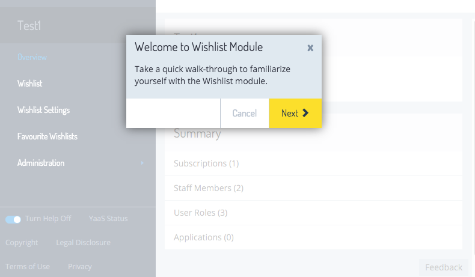
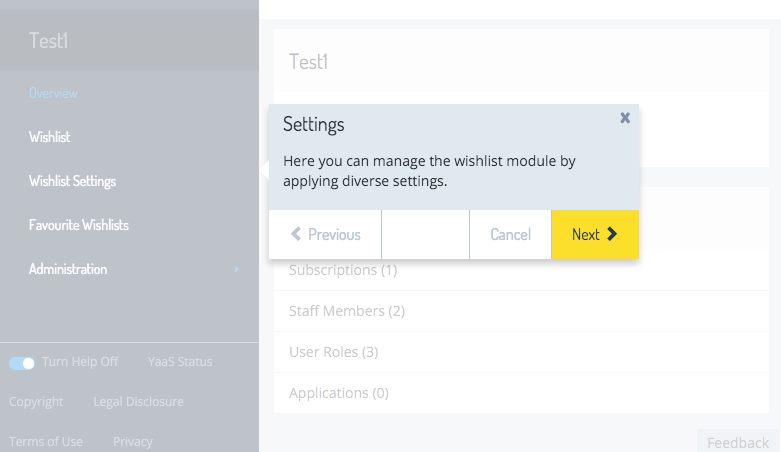

Using the Builder first contact tour for navigation nodes, you can define a step-by-step walkthrough for the navigation nodes of your Builder module that displays whenever a user enters a project with the module for the first time. This helps to orient new users and improves their user experience in the Builder. 

In this tutorial, you will learn more about how to define the first contact tour for the navigation nodes of your Builder module.

### First contact tour structure

The first contact tour consists of a series of steps. Each step describes one particular navigation node. Optionally, you can define an introductory step that is not bound to any navigation node and is shown as a first step of the tour.


### Tour steps in the module.json file

In order to use the first contact tour functionality, you must define your tour steps in the **module.json** file of your Builder module. Each step is defined by a **tourStep** element:

```
{
      "tourStep": {
          "heading": "main.head",
          "text": "main.text"
      },
      "widgets": [
          {
              "id": "wishlist#1",
              "title": "Wishlist",
              "settings": {
                  "description": "Main widget for the Wishlist.",
                  "viewUrl": "/#!/wishlist/",
                  "required": true
              },
              "tourStep": {
                  "heading": "wishlist.head",
                  "text": "wishlist.text"
              }
          },
          {
              "id": "wishlist#3",
              "title": "Wishlist Settings",
              "settings": {
                  "viewUrl": "/#!/administration/settings/"
              },
              "tourStep": {
                  "heading": "settings.head",
                  "text": "settings.text"
              }
          },
          {
              "id": "wishlist#4",
              "title": "Favourite Wishlists",
              "settings": {
                  "viewUrl": "/#!/administration/favourite/"
              },
              "tourStep": {
                  "heading": "favourite.head",
                  "text": "favourite.text"
              }
          }
      ],
      "translations":{
          "en" : {
              "wishlist#1" : "Wishlist",
              "wishlist#3" : "Wishlist Settings",
              "wishlist#4" : "Favourite Wishlists",
              "main.head" : "Welcome to the Wishlist Module",
              "main.text" : "Take a quick walkthrough to familiarize yourself with the Wishlist module.",
              "wishlist.head" : "Wishlists",
              "wishlist.text" : "Here you can search for, view, and manage your wishlists.",
              "settings.head" : "Settings",
              "settings.text" : "Here you can manage the Wishlist module by applying diverse settings.",
              "favourite.head" : "Favourites",
              "favourite.text" : "And, last but not least, here you can find and manage your favorite wishlists."
          }
      }
}
```

You can see the introductory module-level tour step at the top, and then a separate tour step is included on each navigation node. The headings and texts of these tour steps are localized. The **heading** and **text** attributes contain localization keys and the real texts are in the **translations** section of the **module.json** file.


### Screenshots

These images show how the tour looks in the Builder, for both the introductory step and a navigation node step.


Introductory step:




A step describing the navigation node:



