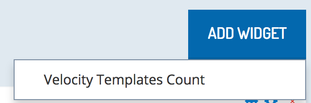
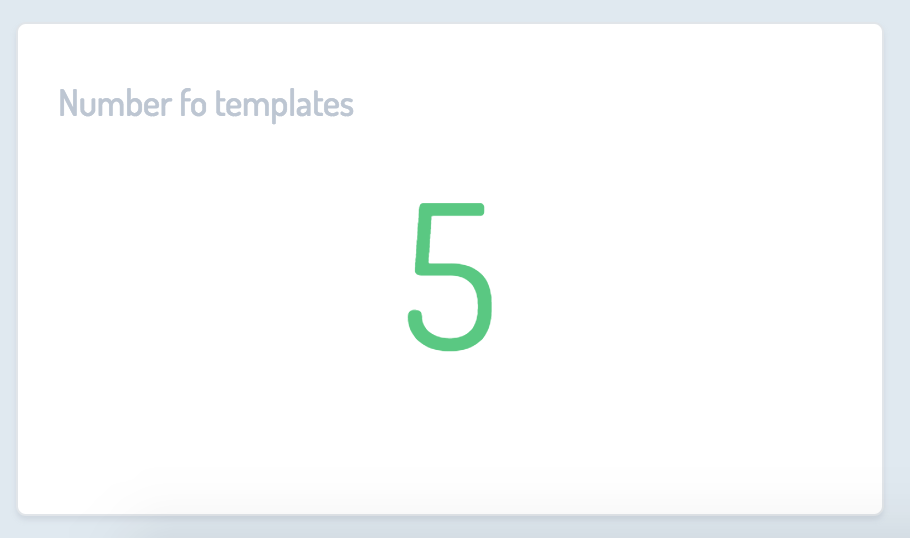

Widgets make retreiving data simple. They are the ideal tool for both developer and business user to obtain a quick glimpse of key information affecting their perspective tasks. The flexibility that widgets offer make it easy for developers to customize widgets to the needs of their project. Business users avoid an extended search for information found after several clicks.

This tutorial is a guide to creating a widget that shows the total number of email templates. Familiarize yourself with the requirements and accessibility of your widget before following the steps to generate the necessary files for development.

### Requirements

#### Access to velocity templates

To fetch and visualize the data, the widget needs to access the <b>velocity templates</b> service. This means that the project using the widget needs to have permission to use this endpoint:  https://api.us.yaas.io/hybris/velocity-template/v1.

#### A subscripton to the email package

Before starting the implementation, make sure that your project has a subscription to the email package.

Subscribing to package from different markets gives you access to services deployed in different regions. In this guilde, we assume that the subscription is on the US or BETA market. If your subscription comes from the German market, consume data for the EU region.

### Who can use widgets that I implement and deploy?

 Your widgets is visible: 

 - in your project if it is developed and registered as a builder module in the same project.
 - to all projects subscribed to the package containing the widget. 

### Which resources can a widget access?

 - A widget can consume any services accessible to the project that the widget is used in. Accessible services can be ones originating from subscriptions or from your own development.
 - Scopes defined for widget restrict data access according to the same rules as those applying for regular builder modules. 

### Generate files

From a technical point of view, a widget is a builder module. So, use the Builder CLI to create a new builder module. 

1. Run the command `$ builder createModule widget` from a command line.

    ```
    $ builder createModule widget

    Available templates:

    0. simple - Only the bare minimum needed for a builder module.
    1. demo - Contains many examples of various features.
    2. list - A view displaying a list, already prepared for making calls to an API via Restangular.
    3. uiExtensibilityHost - Contains a view capable of including plugin modules.
    4. uiExtensibilityPlugin - Plugin module example.
    5. projectDashboardWidget - Project Dashboard Widget example.
    ```

2. Select Option 5. 
3. Provide some details about the data your widget consumes.  Indicate the API from which your widget consumes data.

    ```
    Please enter name for your widget.
    > Velocity Templates Count
    Please enter base url of the service for your widget.
    > https://api.us.yaas.io/hybris/velocity-template/v1
    Please enter resource for your widget to consume.
    > /templates

    ```

4. Inspect the generated files. The files are:

     - the widget view (widget.html) and the controller (widgetApp.js) 
     - the module descriptor (module.json)
     - auth.html. This file gives the widget the ability to consume its own authorization context
     - manifest.yml and nginx.conf support deployment  

### Implement the view and the controller

Implement the view and the controller so that your widget consumes the endpoint _https://api.us.yaas.io/hybris/velocity-template/v1/{currentProject}/templates_ and shows the total count of velocity templates defined in the current project.

**widgetApp.js**

```
    angular.module('widgetApp', ['builderPlugin'])
    .controller('WidgetCtrl', ['$scope','Restangular',function($scope, Restangular){
        $scope.totalCount;
        BuilderPlugin.ready(function() {
            $scope.currentProjectId = BuilderPlugin.authorizationData.tenantId
            Restangular
                .setBaseUrl(BuilderPlugin.settings.serviceBasePath)
                .withConfig(function(RestangularConfigurer) {
                    RestangularConfigurer.setFullResponse(true);
                })
                .one($scope.currentProjectId+"/templates?pageSize=1&pageNumber=1&totalCount=true") // append &totalCount=true if you need totalCount in the response
                .getList()
                .then(function(response){
                    $("#spinner").remove();
                    $scope.totalCount = response.headers("Hybris-Count");
                },function(error){
                    $("#spinner").remove();
                    //handle error
                }); 
        });
    }]);
```

**widget.html**

```
    <!DOCTYPE html>
    <html>
        <head lang="en">
            <meta charset="UTF-8">
            <!-- custom stylesheets -->
            <link href="https://builder.yaas.io/public/css/styles.css" rel="stylesheet"/>
            <script src="https://builder.yaas.io/public/js/vendor/jquery/dist/jquery.min.js"></script>
            <script src="https://builder.yaas.io/public/js/vendor/underscore/underscore.js"></script>
            <script src="https://builder.yaas.io/public/js/vendor/angular/angular.js"></script>
            <script src="https://builder.yaas.io/public/js/vendor/restangular/dist/restangular.js"></script>
            <script src="https://builder.yaas.io/public/js/builder_plugin.js"></script>
            <script src="js/widgetApp.js"></script>
            <title>Widget</title>
        </head>
        <body class="widget-wrapper" ng-app="widgetApp">
            <div class="panel panel-default" id="spinner">
                <div class="panel-body">
                    <div class="spinner">
                        <div class="spinner-container spinner-container1">
                            <div class="spinner-circle1"></div>
                            <div class="spinner-circle2"></div>
                            <div class="spinner-circle3"></div>
                            <div class="circle4"></div>
                        </div>
                        <div class="spinner-container spinner-container2">
                            <div class="spinner-circle1"></div>
                            <div class="spinner-circle2"></div>
                            <div class="spinner-circle3"></div>
                            <div class="circle4"></div>
                        </div>
                        <div class="spinner-container spinner-container3">
                            <div class="spinner-circle1"></div>
                            <div class="spinner-circle2"></div>
                            <div class="spinner-circle3"></div>
                            <div class="circle4"></div>
                        </div>
                    </div>
                </div>
            </div>
            <div sizeElement class="widget-container" ng-controller="WidgetCtrl">
                <h4>Number fo templates</h4>
                <h1 class="numbotron-value">{{totalCount}}</h1>
            </div>
        </body>
    </html>

```

### Run the widget locally

Run the widget locally using the command line interface.

```
$ builder runModule

```
Go to https://localhost:8081/builder/module.json in your browser and accept the security exception. 

### Register local instance of your widget

Defining a widget Builder Module is no different from defining any other Builder module. When registering a widget module, you should complete the same tasks as for other modules:

 - Provide a URL for the **module.json** file indicating where the file was deployed.(For a locally running widget, use `https://localhost:8081/builder/module.json`)
 - Specify what the module can do on behalf of the tenant. In this case, required scopes are <b>hybris.email_view</b> and <b>hybris.velocitytemplate_admin</b>.
 - Make sure that you define the redirect URI for the widget: `https://localhost:8081/builder/auth.html`. This endpoint is important for the widget to capture the access token that grants its authorization context.
 - Enable 'Use this Builder Module for my project' option do enable the widget in your project.


### Review the widget

Go to your project dashboard and check that your widget is available in your project.

<br><br>

<br><br>

Now you can deploy the widget to a remote location. Once you deploy it, go to the builder module definition and adjust the URLs so that they point to the remote deployment location:

- `https://{baseUrl of your widget}/builder/auth.html`
- `https://{baseUrl of your widget}/builder/module.json`


