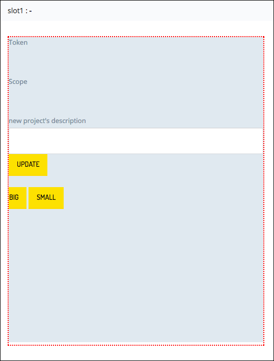

After you have implemented, deployed, and published your Builder UI module, it is visible in the Builder for tenants who subscribe to the package containing the module. In other words, the basic functionality of the Builder can be extended with additional modules when tenants subscribe to the related packages.

Imagine that subscriptions extend specific Builder UI modules. For example, a user subscribes to "package A". By doing this, the Builder "module A" is subsequently enabled. Module A contains an extension point called "slot A". The subscription to module A also triggers the declaration of an extension point in "slot A". Now, when the user subscribes to a "package B", the extension point of slot A enriches module A with a plug-in orginating from module B.


### Create a host module

To embed plug-in modules, start by defining the host module. The host module is basically a regular Builder module. However, it should have an extra JavaScript API that supports the Builder plug-in mechanism. It should also define slots for the plug-ins.

You can create a new host module from a template using the `createModule` command of the Builder CLI. Just select **uiExtensibilityHost** from the list of available templates.

```
$ builder createModule host

Available templates:

0. simple - Only the bare minimum needed for a Builder module
1. builderShowcase - Contains many examples of various features
2. list - A view displaying a list, already prepared for making calls to an API via Restangular
3. uiExtensibilityHost - Contains a view capable of including plug-in modules
4. uiExtensibilityPlugin - Plug-in module example
```

Notice that the generated files exhibit some new features compared to a simple Builder module:
 - Metadata in the **module.json** file declares this module (**extensiblemodule**) as `extensible : nested`. The `nested` value indicates that plug-ins can be nested in the predefined slots of the host template.
 - The **index.html** file includes the **builder_plugin.js** file which is a dedicated JavaScript API to enable integration with plug-ins.
 - The **index.html** file contains an extension slot. One of the span elements is named as an extension slot (**slot1**) using the **builder-extension-slot** attribute.
 - The **.js** file uses the supporting API: _BuilderExtensible_.

### Create a plug-in module

To create a plug-in module, use the `createModule` command of the Builder CLI. Select the **uiExtensibilityPlugin** from the list of available templates.

Generated files of the plug-in module also contain some features related to the extensibility mechanism:
 - Metadata in the **module.json** file declares that this module is a plug-in because it is _extending **slot1** of the  **extensiblemodule**_.
 - The **auth.html** file was generated to serve as a dedicated resource that captures the access token for the plug-in after successful authorization.
 - The **plugin.html** file includes the **builder_plugin.js** file, which is a dedicated JavaScript API, to enable integration of the plug-in module with host.
 - The **.js** file uses the supporting API _BuilderPlugin_.
 
### Builder module plug-in integration

When the user opens a project in the Builder, the system examines all of the subscribed packages that the project contains. Then, the included modules become available in the Builder's navigation. Next, the system combines all of the subscribed plug-in modules with matching subscribed hosts, so that when the host module displays to the user, the Builder already knows all of its currently available extensions and assigns them to their target slots. 

#### Context of the plug-in module
 
Even though a plug-in module is embedded in the host module, it doesn't share the authorization context with the host. Plug-ins have their own, completely isolated authorization context, which is not accessible by the host module (and vice versa). When the Builder examines the available module plug-ins, it issues an authorization request for each of them, requesting scopes as defined in the module definition. The authorization success redirection is captured by the plug-in (via a dedicated resource hosted by the plug-in, **/builder/auth.html**) so that it keeps the access token private. 

#### Host initialization
 
When the host module is loaded, it calls: 
```
BuilderExtensible.injectExtensions();
```

As a result, an iframe element is appended to every extension slot for which a matching available plug-in module was found. The plug-in module's documents are loaded in those iframes.

#### Plug-in initialization

When the plug-in module is loaded in the iframe, it declares a callback function that should be called when the context of the plug-in is ready: 
```
 BuilderPlugin.ready(function() {
        $scope.token = BuilderPlugin.authorizationData.accessToken;
        $scope.scope = decodeURIComponent(BuilderPlugin.authorizationData.scope);
        $scope.tenantId = BuilderPlugin.authorizationData.tenantId;
        $scope.clientId = BuilderPlugin.authorizationData.clientId;
        
        //do what you need to do once the plug-in has its context ready...
    });
```

Additionally, when the plug-in's document within the host's slot is ready, the plug-in sends an event to the host informing it about the resulting height and width.
This way, it requests a resize operation of its target slot so that it fits the plug-in. 

#### General purpose events

You can use events to transfer data between the host and plug-ins, in both directions.

Here is an example of how to send an event from a host module to all the plug-ins that extend it:
```
BuilderExtensible.sendEvent('myHostEvent', data);
```

Here is an example of how to react on the event in the plug-in module:
```
BuilderPlugin.on('myHostEvent', function(data) {
    // myHostEvent callback function
});
```

Use the following example to transfer data from the plug-in to the host: 
```
BuilderPlugin.sendEvent('myPluginEvent', data);
```

Use the following example to react on the event in the host module:
```
BuilderExtensible.on('myPluginEvent', function(data) {
    // myEvent myPluginEvent function
});
```

### Register host and plug-in modules

Extensible hosts and plug-in modules must be registered in YaaS just like all other Builder modules. So, after you have implemented and deployed them, use the Builder to register the modules in YaaS. Include the hosts and plug-in modules in the target packages that your project provides.   

Defining a host module is no different from defining any other Builder module. 
When registering a plug-in module, you should complete the same tasks as for other modules:
 - Provide a URL for the **module.json** file where it was deployed.
 - Specify what the plug-in can do on behalf of the tenant (the *authorization scopes* of the module),
but pay special attention when defining redirect URIs.
 - Make sure that you define the redirect URI for the plug-in: `https://{baseURL of your plug-in}/builder/auth.html`. This endpoint is important for the plug-in to capture the access token that was granted for its authorization context.
 
### Controlling slot size 

Since plug-in modules do not all have the same size, it is important that you have the ability to adjust the size of the iframe in which the plug-in should fit. For example, a plug-in that displays product ratings may require more space than one that simply displays a single button. 

This example shows slot sizing into .js.  

```
$scope.big = function() {
 $("body > div").css("height","600px");
 $("body > div").css("width","500px");
 BuilderPlugin.requestResize();
    };

$scope.small = function() {
 $("body > div").css("height","400px");
 $("body > div").css("width","300px");
 BuilderPlugin.requestResize();
    };
    
```

Notice the function `requestResize` which has been inheirited from the **builder_plugin.js** file. After the dimensions for the `<div>` tags are set, the function `requestResize` triggers the resizing.

With the .js adapted, you can next introduce functionality into your view. In this example, clicking the buttons BIG and SMALL resize the plug-in frame. Clicking on the button <b>SMALL</b> resizes the frame to 400 x 300 pixels.  Clicking on the button <b>BIG</b> changes the dimensions to 600 x 500 pixels.




Here is the code:

```
<body style="padding: 0; height: auto;" ng-controller="PluginController">
<div sizeElement style="width: 500px; height: 600px; overflow: hidden;">

    <div class="row">
        <div class="col-sm-6 col-xs-12">
            <div class="form-group">
                <label class="control-label">Token</label>
                <p class="form-readonly-text form-readonly-text-lg 
                ng-binding">{{token}}</p>
            </div>
        </div>

        <div class="col-sm-6 col-xs-12">
            <div class="form-group">
                <label class="control-label">Scope</label>
                <p class="form-readonly-text 
                form-readonly-text-lg ng-binding">{{scope}}</p>
            </div>
        </div>

        <div class="col-sm-6 col-xs-12">
            <div class="form-group">
                <label class="control-label">new project's description</label>
                <input type="text" class="form-control input-lg" ng-model="project.description" name="description">
                <button type="button" class="btn btn-warning" ng-click="updateProject()">UPDATE</button>
            </div>
        </div>

        <button type="button" class="btn btn-warning" ng-click="big()">BIG</button>
        <button type="button" class="btn btn-warning" ng-click="small()">SMALL</button>

    </div>

</div>
</body>
    
```

