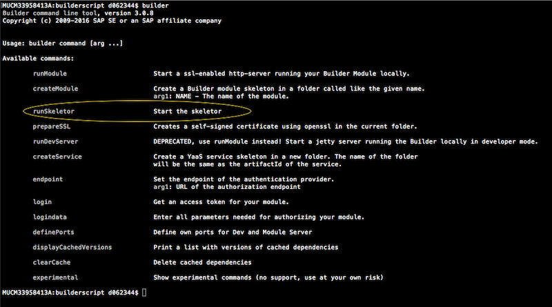
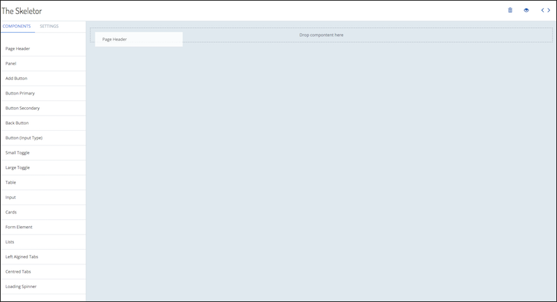
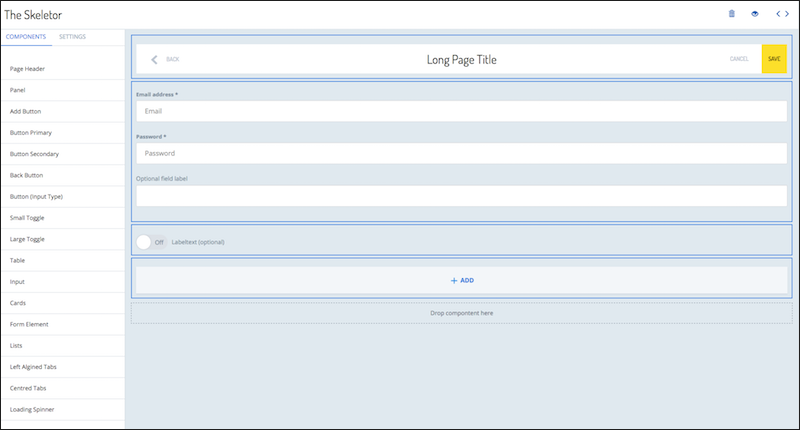
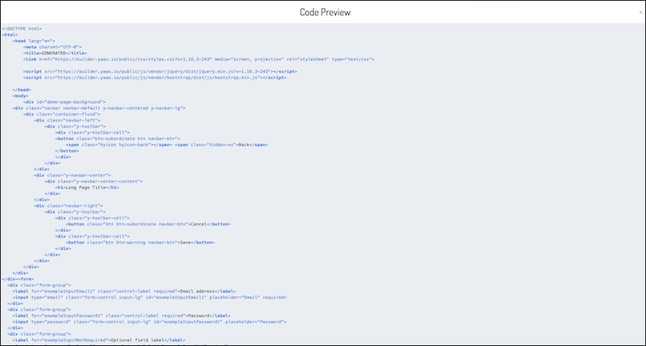
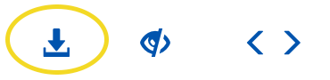
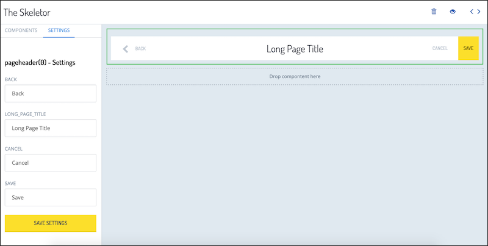

<h3>Design a Builder UI with Skeleton Creator</h3>

The Builder CLI features the Skeleton Creator tool, with which you can easily create views just by dragging and dropping UI components. Here are the steps to get started. 

1. Open a terminal window.

  

2. Run the command `builder runSkeletonCreator` to start the Skeleton Creator. The HTTP server starts locally.
3. Enter the URL <b>http://localhost:8082</b> in a browser.  The Skeleton Creator design interface will appear.
4. To design a view, drag and drop the components from the left of the screen onto the main screen. Organize the components as they should appear in the Builder UI.

  

5. After you create the view, click the preview button to the right of the delete button.  The browser immediately stores your view in the local cache. That means you will not loose the view until you delete it by explicitly clicking on the delete button.

 

6. Export the code that the Skeleton Creator generates by clicking on the show button to the right of the preview button.

Here is an example of a UI with its corresponding code preview: 

  
  

If you are using Chrome or Firefox, a download button is available in preview mode allowing you to download the code to a file.

  
Internext Explorer and Safari do not support the download button. Instead, you can copy the HTML code directly from the broswer.   

**Component settings**

You can adjust the settings for each component in the Skeleton Creator. This allows you to assign custom text and and labeling to the component. For example, the <strong>Page Header</strong> component features a <strong>Back</strong> button, a long page title, as well as a <strong>Save</strong> and <strong>Cancel</strong> button by default. You can set the default text of the title and rename each of the buttons.

 
    
  

<h3>Dev Mode to preview your module</h3>

Now that you have created your builder module, you can enable Developer Mode. After enabling this mode, link the Builder to your local module that you created in the last section. This connection makes it possible to begin previewing the HMTL and adding navigation nodes to your module directly in the Builder. You cannot yet call APIs. 

**Enabling Developer Mode**

To enable Developer Mode take the following steps:

1. Navigate to the project home page and click on Development. 
2. Switch Developer Mode on. A dark gray action bar appears at the bottom of the screen from which you can access <b>Settings</b> or exit Developer Mode.
3. Click on <b>Settings</b> on the action bar.
4. To show the locally developed Builder module, switch on the toggle <b>Show local module</b>
5. Enter the URL that points to your module that is running locally. Example: https://localhost:8081/builder/module.json
6. The module is now available for preview. You can begin to develop and test your module in Developer Mode.   

**Testing the behavior of your module**

By switching the scopes of the module on and off, you can test the behavior of your module at various levels of authorization. Access the scopes of your local module by opening <b>Settings from the gray action bar.</b> Under <b>Scopes</b> you can use the toggles to turn the various scopes on and off.
