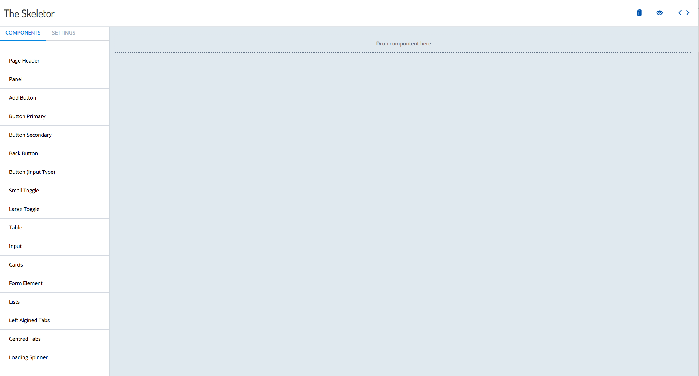

The Builder CLI features the Skeletor tool with which you can easily create user interfaces just by dragging and dropping UI components. 

To run and use Skeletor:


1. Open a terminal window 
2. Navigate to the folder that contains your builder module.

 <br><br>

3. Run the command ```./builder runSkeletor``` to start the Skeletor. The HTTP server will start locally.
4. Enter the URL http://localhost:8082 in a browser.  The Skeletor design interface will appear. 
5. To design a UI, drag and drop the components from the left of the screen onto the main screen. Organize the components as they should appear in the Builder UI. 

  <br><br>
6. After you have created the UI, export the code that Skeletor generates. To do this click on the brackets icon in the top right corner of the screen.

  <br><br>
7. Here is an example of a UI with its corresponding code preview:

  <br><br>
  <br><br>
  
  You can copy the HTML code directly from the broswer. Some browsers allow you to download the code to a file.